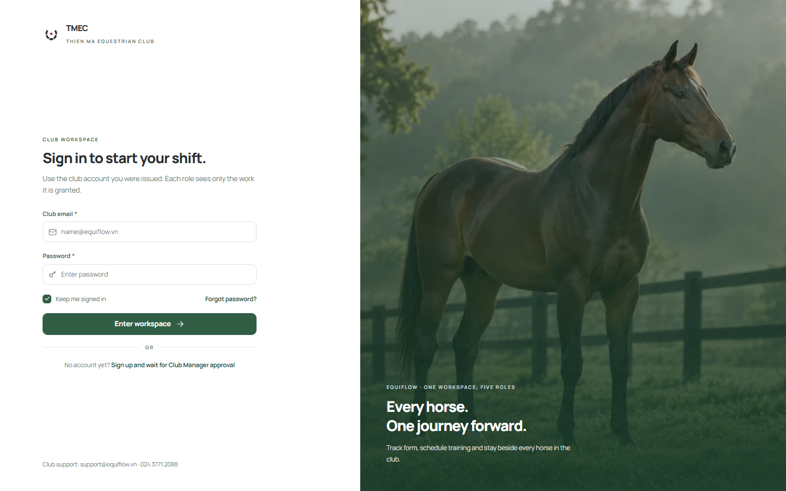
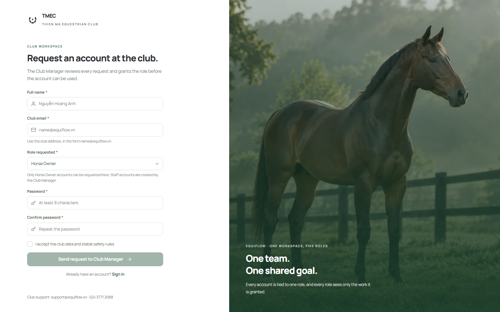
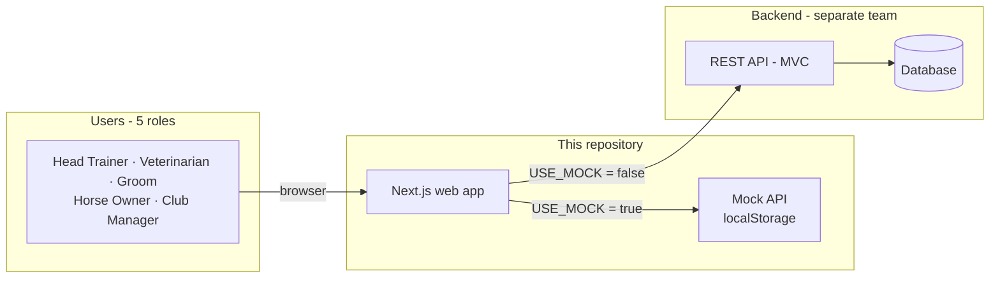
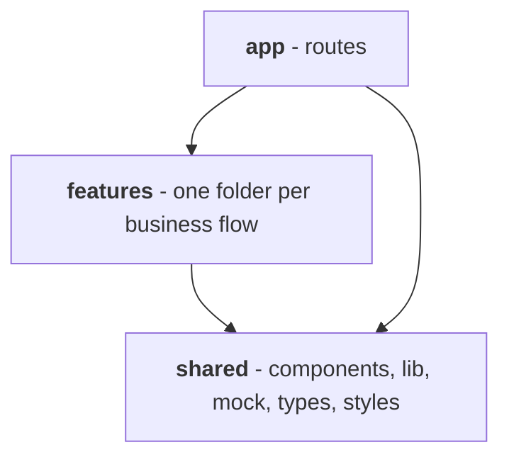

<div align="center">


# EquiFlow

**Web app for managing a racing-horse club: horse profiles, training plans, health care and reports, with a separate workspace for each of five roles.**

[](https://github.com/MinhMQ1711/Horse-Training-Club/actions/workflows/ci.yml)


*SWP391 course project · Thiên Mã Equestrian Club (TMEC)*

</div>

<p align="center">
  
  
</p>

---

## Table of contents

- [Overview](#overview)
- [Features](#features)
- [System overview](#system-overview)
- [Tech stack](#tech-stack)
- [Getting started](#getting-started)
- [Project structure](#project-structure)
- [Documentation](#documentation)
- [Roadmap](#roadmap)
- [Contributing](#contributing)
- [Acknowledgements](#acknowledgements)

## Overview

A racing club has five groups of people who need different things from the same data. **EquiFlow** gives each of them a workspace that shows only what their role is allowed to do:

| Role | Works with |
|---|---|
| **Head Trainer** | Training plans, weekly calendar, live monitoring, threshold alerts |
| **Veterinarian** | Herd health, medical records, prescriptions, training locks |
| **Groom / Stable Hand** | Daily tasks, stall map, meal rations, incident reports |
| **Horse Owner** | Their own horses: health, training progress, cost and race reports |
| **Club Manager** | Accounts and permissions, master data, club-wide reports, audit log |

This repository is the **front end**. The REST backend is built by a separate team. While it is not ready, the app runs on a built-in **mock API**, so every screen can be developed and demonstrated on its own.

## Features

**Available now (Priority 1: authentication and access control)**

- Sign up for Horse Owners, with email checked by a **6-digit OTP** (no links)
- Log in with clear states for locked, pending, rejected and inactive accounts
- Forgot password: email → OTP → new password, with a neutral answer that never reveals whether an email exists
- App shell with a sidebar that changes per role
- **Role-based access control** in three layers: hidden menu items, blocked routes (403 page), and disabled buttons that explain why
- Club Manager screens: account list, approve / decline / lock / unlock, per-account permission switches
- Session-expired handling, My Profile, change password

**Planned:** horse profiles and pedigree, training plans with threshold alerts, health records with the **Training Lock**, dashboards and audit log, then stable care and racing. See the [roadmap](#roadmap).

## System overview



Code is organised in three layers, and imports only go downwards:



More diagrams (request flow, sign-up and OTP sequences, account lifecycle, RBAC, data model) are in [docs/ARCHITECTURE.md](docs/ARCHITECTURE.md).

## Tech stack

| Area | Choice |
|---|---|
| Framework | [Next.js 16](https://nextjs.org/) (App Router), [React 19](https://react.dev/) |
| Language | TypeScript (strict mode) |
| Styling | Plain CSS + CSS Modules, design tokens from the EquiFlow Design System. No Tailwind, no UI kit |
| Data | Mock API in the browser now; REST backend with session cookie later |
| Fonts | Manrope and DM Sans, self-hosted (Vietnamese characters included) |
| Quality | [Oxlint](https://oxc.rs/docs/guide/usage/linter), TypeScript type check, GitHub Actions |

## Getting started

**Requirements:** Node.js 20.9 or newer, and npm.

```bash
git clone https://github.com/MinhMQ1711/Horse-Training-Club.git
cd Horse-Training-Club
npm install
cp .env.example .env.local      # Windows PowerShell: Copy-Item .env.example .env.local
npm run dev
```

Open <http://localhost:3000>.

### Demo accounts

Every account uses the password **`equiflow123`**. The OTP code is always **`123456`**.

| Email | Role | Status | What you will see |
|---|---|---|---|
| `viet.do@equiflow.vn` | Club Manager | Active | Accounts and Permissions screens |
| `nam.tran@equiflow.vn` | Head Trainer | Active | Training menu; opening `/accounts` shows the **403** page |
| `chau.le@equiflow.vn` | Veterinarian | Active | Medical menu |
| `ha.ly@equiflow.vn` | Horse Owner | Active | Owner menu |
| `binh.pham@equiflow.vn` | Groom | Locked | "Account locked" message at login |
| `anh.nguyen@equiflow.vn` | Horse Owner | Pending approval | "Waiting for approval" message |

> **Try RBAC in one minute:** log in as the Club Manager → Accounts → Permissions of *Trần Văn Nam* → switch off "Create and edit Training Plans" → Save. Log in as Nam and the **Training Plans** menu item is gone; typing `/plans` shows the 403 page.

Demo data lives in the browser's `localStorage`. To reset it, delete the key `equiflow.mock.db.v1` in DevTools → Application.

### Scripts

| Command | Purpose |
|---|---|
| `npm run dev` | Start the dev server with hot reload |
| `npm run build` | Type-check and produce a production build. **Must pass before opening a pull request** |
| `npm run start` | Serve the production build |
| `npm run lint` | Lint the code with Oxlint |

### Configuration

Set in `.env.local` (never committed). Restart `npm run dev` after changing it.

| Variable | Default | Meaning |
|---|---|---|
| `NEXT_PUBLIC_USE_MOCK` | `true` | `true` uses the built-in mock API. Set to `false` once the backend is ready |
| `NEXT_PUBLIC_API_URL` | `http://localhost:8080/api` | Address of the real backend |

## Project structure

```text
Horse-Training-Club/
├── .github/                  CI workflow, pull request and issue templates
├── docs/                     Architecture, API contract, guides, images
├── public/                   Static files: fonts, logo, images
├── src/
│   ├── app/                  Routes (Next.js App Router). Each page.tsx is thin
│   ├── features/             One folder per business flow
│   │   ├── auth/             Login, sign up, OTP, forgot password, profile      (P1)
│   │   ├── accounts/         Account list, permissions                           (P1)
│   │   ├── horses/           Horse profiles                                      (P2)
│   │   ├── intake/           Bringing a horse into the club                      (P2)
│   │   ├── master-data/      Staff, supplies, stalls                             (P2)
│   │   ├── training/         Plans, calendar, live monitor, alerts               (P3)
│   │   ├── health/           Health, treatments, Training Lock                   (P4)
│   │   ├── dashboard/        Dashboards, reports, audit log                      (P5)
│   │   ├── stable/           Daily stable care, optional                         (P6)
│   │   └── racing/           Race entries and results, optional                  (P7)
│   └── shared/               Used by every feature
│       ├── components/       ui/  form/  layout/
│       ├── lib/              api, auth, permissions, status, messages
│       ├── mock/             Fake data and fake API
│       ├── styles/           Design tokens, fonts, global CSS
│       └── types/            Shared TypeScript types
├── CLAUDE.md                 Rules for the AI coding assistant used by the team
├── CONTRIBUTING.md           How to contribute
└── package.json
```

Each feature has the same shape: `pages/`, `components/`, `api.ts`, `types.ts`. Rules:

1. `app` → `features` → `shared`. Never import upwards.
2. A feature never imports another feature. If two need the same thing, move it to `shared/`.
3. Pages call `features/*/api.ts`, never `fetch`. Only `shared/lib/api.ts` talks to a backend.
4. Who may do what is decided in one file: `shared/lib/permissions.ts`.

## Documentation

| Document | Language | What is inside |
|---|---|---|
| [docs/ARCHITECTURE.md](docs/ARCHITECTURE.md) | English | System diagrams: context, layers, request flow, auth, account lifecycle, RBAC, data model |
| [docs/API_CONTRACT.md](docs/API_CONTRACT.md) | English | Every endpoint the web app expects, with error codes. For the backend team |
| [docs/PROJECT_GUIDE.md](docs/PROJECT_GUIDE.md) | Vietnamese | What every folder and file does, and "where do I change X?" |
| [docs/HUONG_DAN_HOC.md](docs/HUONG_DAN_HOC.md) | Vietnamese | Study guide with sample questions for the course defence |
| [CONTRIBUTING.md](CONTRIBUTING.md) | English | Branches, commits, pull requests |

## Roadmap

| Phase | Scope | Status |
|---|---|---|
| **P1** | Authentication and RBAC | Done |
| **P2** | Horse profiles, intake, master data | Planned |
| **P3** | Training plans, live monitor, threshold alerts | Planned |
| **P4** | Health records, injuries, Training Lock | Planned |
| **P5** | Dashboards, reports, audit log | Planned |
| P6 | Stable and nutrition (optional) | Planned |
| P7 | Racing (optional) | Planned |

P1 to P5 are required by the course. P6 and P7 are done if time allows.

## Contributing

Work happens on feature branches and is merged into `main` through a pull request. Read [CONTRIBUTING.md](CONTRIBUTING.md) first. The short version: `npm run build` must pass, and use the existing components and design tokens instead of writing new ones.

## Acknowledgements

- Built for the **SWP391 – Software Development Project** course at FPT University.
- Fonts [Manrope](https://fonts.google.com/specimen/Manrope) and [DM Sans](https://fonts.google.com/specimen/DM+Sans) are licensed under the SIL Open Font License (see `public/fonts/`).
- The horse photograph on the login screen was generated for this project.
