# Architecture

System model of **EquiFlow / TMEC** (Thiên Mã Equestrian Club). Every diagram below is written in [Mermaid](https://mermaid.js.org/), so GitHub renders it directly in the browser.

**Contents**

1. [System context](#1-system-context)
2. [Code layers and dependency rule](#2-code-layers-and-dependency-rule)
3. [How a request travels](#3-how-a-request-travels)
4. [Authentication flows](#4-authentication-flows)
5. [Account lifecycle](#5-account-lifecycle)
6. [Access control (RBAC)](#6-access-control-rbac)
7. [Delivery roadmap](#7-delivery-roadmap)
8. [Target data model](#8-target-data-model)

---

## 1. System context

Five kinds of people use the web app. The web app talks to a REST backend built by a separate team. Until that backend exists, the same web app runs against an in-browser **mock API**, so screens can be built and demonstrated without a server.

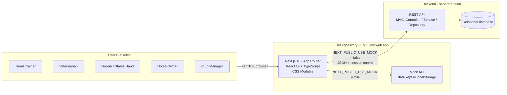

Switching between the two modes is one environment variable. No page needs to change, because pages never call `fetch` directly (see [section 3](#3-how-a-request-travels)).

---

## 2. Code layers and dependency rule

Source code is split into three top-level folders. Imports may only go **downwards**, and features never import each other.

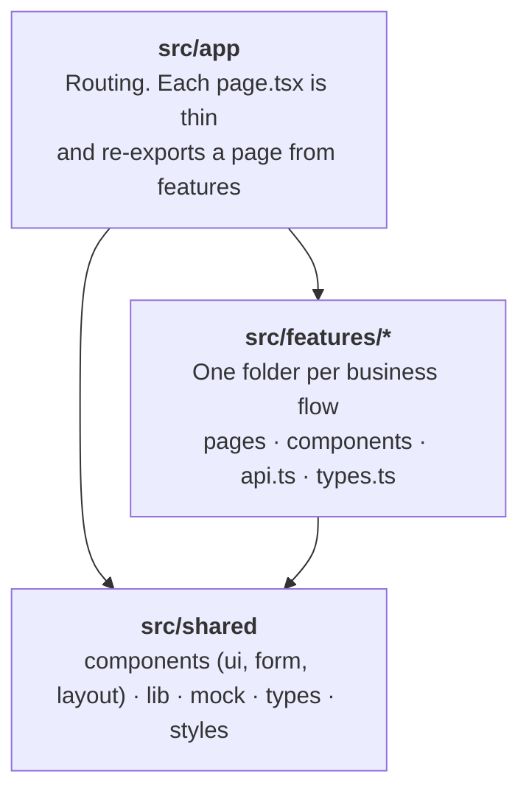

| Rule | Why |
|---|---|
| `app` → `features` → `shared`, never upwards | Keeps the dependency graph a simple tree |
| A feature never imports another feature | Two teams can work in parallel without touching each other's files |
| Something two features both need moves into `shared/` | One copy, one place to fix |
| Pages talk to `features/*/api.ts`, never to `fetch` | The mock/real switch stays in a single file |

Feature folders and who owns them. A folder is created only when its phase starts; today just `auth`, `accounts` and `dashboard` exist.

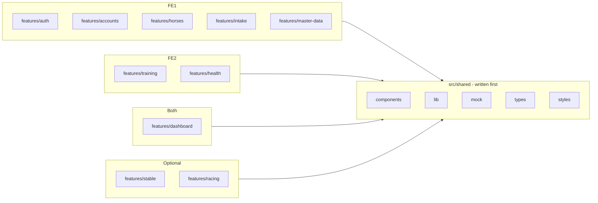

---

## 3. How a request travels

`src/shared/lib/api.ts` is the **only** place that talks to a backend. It also handles the two errors every screen must react to.

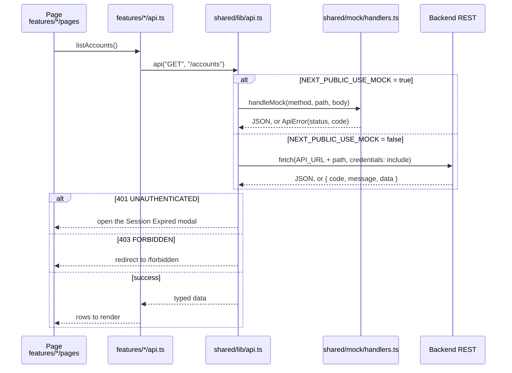

The full list of endpoints and error codes is in [API_CONTRACT.md](API_CONTRACT.md).

---

## 4. Authentication flows

### 4.1 Sign up, email check, approval

Only a **Horse Owner** can sign up on their own. Staff accounts are created by the Club Manager. Email is always verified with a **6-digit OTP**, never a link.

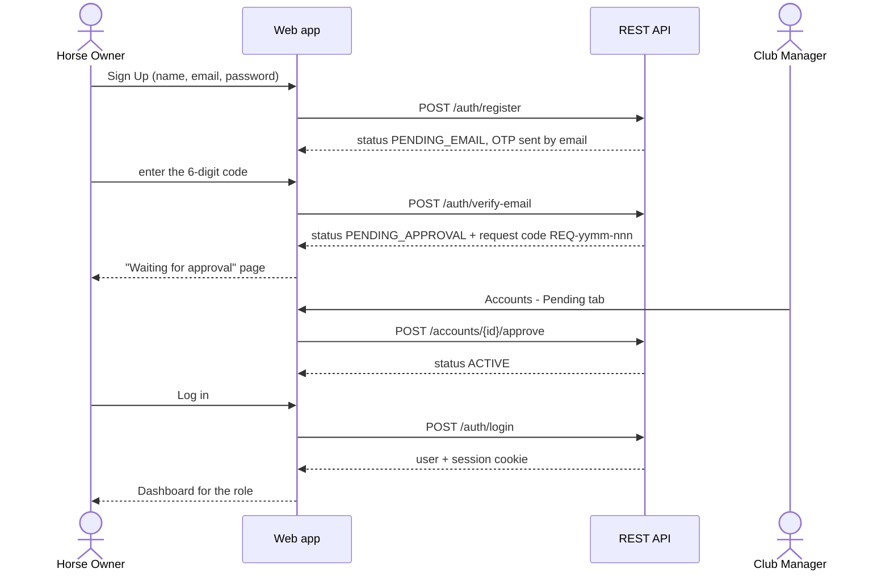

### 4.2 Forgot password

The first step always answers the same way, whether or not the email exists, so nobody can probe which emails have accounts.

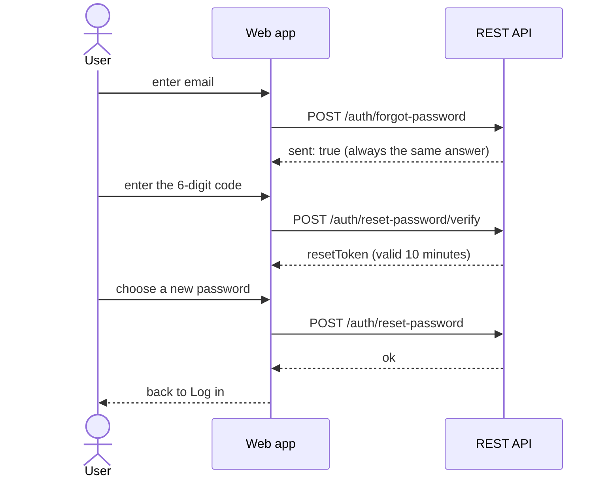

### 4.3 Limits enforced by the backend

| Rule | Value |
|---|---|
| OTP length / lifetime | 6 digits / 10 minutes |
| Resend cooldown | 60 seconds |
| Wrong OTP attempts | 5, then locked out (`429 OTP_ATTEMPTS_EXCEEDED`) |
| Wrong password attempts | 5, then the email is blocked for 15 minutes (`429 ATTEMPTS_EXCEEDED`); the account status does not change |
| Password change reminder | every 180 days |

---

## 5. Account lifecycle

An account is always in exactly one status. Solid arrows exist in the code today; the dashed ones are planned.

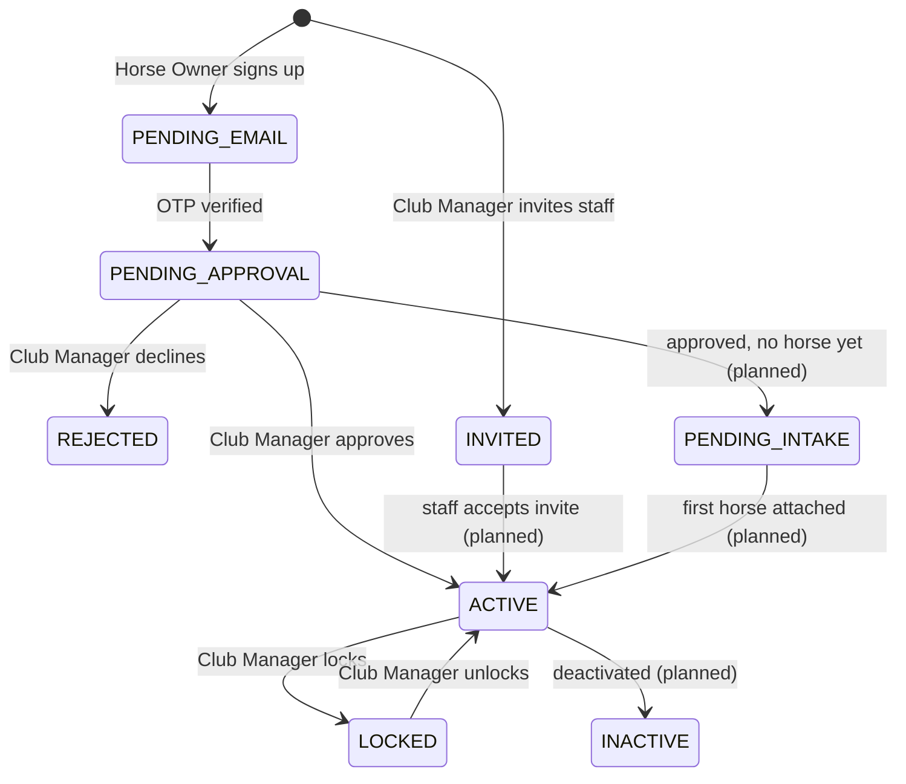

What each status does at login:

| Status | Can log in | Message shown | API code |
|---|:-:|---|---|
| `ACTIVE` | yes | Dashboard | - |
| `PENDING_EMAIL` | no | Email not verified | `403 EMAIL_NOT_VERIFIED` |
| `PENDING_APPROVAL` | no | Waiting for Club Manager | `403 ACCOUNT_PENDING` |
| `PENDING_INTAKE` | no | Waiting for horse intake | `403 PENDING_INTAKE` |
| `INVITED` | no | Invitation not accepted yet | `403 ACCOUNT_INVITED` |
| `INACTIVE` | no | Account deactivated | `403 ACCOUNT_INACTIVE` |
| `REJECTED` | no | Request declined | `403 ACCOUNT_REJECTED` |
| `LOCKED` | no | Account locked | `423 ACCOUNT_LOCKED` |

Guard rails: a Club Manager cannot lock themselves, and the last active Club Manager cannot be locked.

---

## 6. Access control (RBAC)

A single file, `src/shared/lib/permissions.ts`, decides who may do what. Three layers read from it, so a rule is changed in one place.

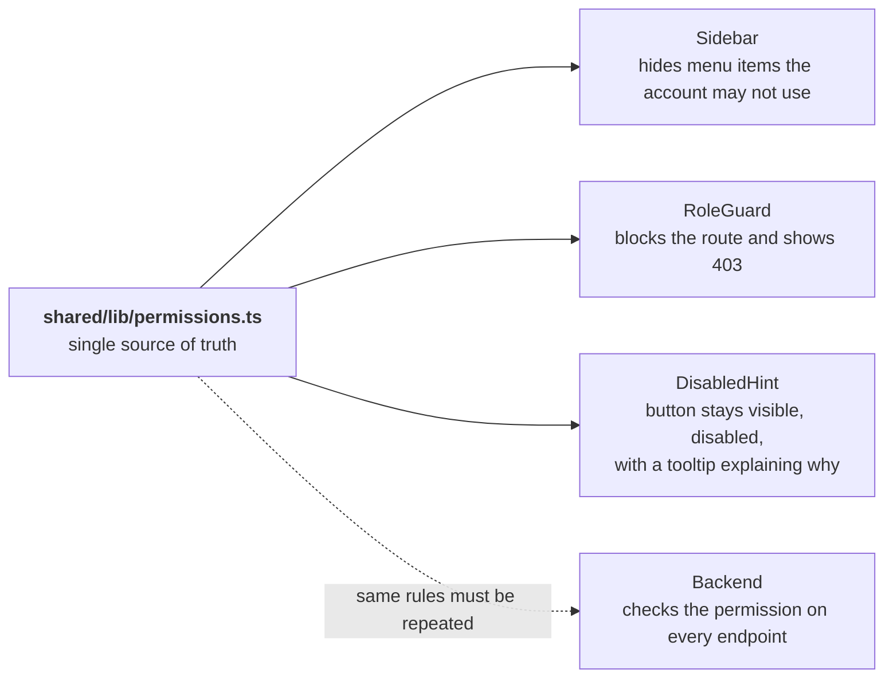

> The UI layers only help the user. **Security is the backend's job**: every endpoint must check the permission again, because a request can be sent without the UI.

### Default permissions per role

| Permission | Head Trainer | Veterinarian | Groom | Horse Owner | Club Manager |
|---|:-:|:-:|:-:|:-:|:-:|
| View horse profiles | ✅ | ✅ | ✅ | ✅ (own horses) | ✅ |
| Create / edit horse profile | ✅ | | | | ✅ |
| Delete / deactivate horse | | | | | ✅ |
| Create / edit training plans | ✅ | | | | |
| Assign daily schedule | ✅ | | | | |
| Record session metrics | ✅ | | | | |
| Acknowledge threshold alerts | ✅ | | | | |
| View medical records | ✅ (read-only) | ✅ | | | ✅ |
| Place a training lock | | ✅ | | | |
| Lift a training lock | | ✅ | | | |
| Manage accounts and permissions | | | | | ✅ |
| View the audit log | | | | | ✅ |

Some switches cannot be changed on purpose: viewing horses is granted to everyone, only a Veterinarian can place or lift a lock, and the Club Manager always keeps account management so they cannot lock themselves out.

### Sidebar per role

| Role | Menu groups |
|---|---|
| Head Trainer | Workspace · Training · Monitoring · Racing · Reports |
| Veterinarian | Workspace · Medical · Reports |
| Groom | Workspace · Daily · Supplies |
| Horse Owner | Workspace · Monitoring · Reports |
| Club Manager | Workspace · Administration · Master Data · Reports |

---

## 7. Delivery roadmap

Work follows the priority order below. `P1` to `P5` are required by the course, `P6` and `P7` are optional.

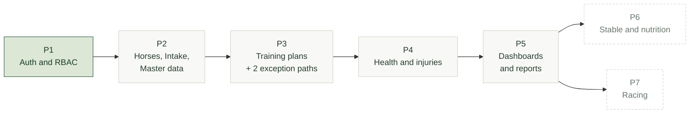

| Phase | Scope | Owner | Status |
|---|---|---|---|
| P1 | Sign up, OTP, forgot password, app shell, RBAC, accounts, permissions, 403, session expired, profile | FE1 | Done (16 routes) |
| P2 | Horse profiles, intake, staff / supplies / stall master data | FE1 | Not started |
| P3 | Training plans, calendar, live monitor, threshold alerts | FE2 | Not started |
| P4 | Herd health, medical records, injury map, **Training Lock** | FE2 | Not started |
| P5 | Trainer / Manager dashboards, Owner report, audit log | FE1 + FE2 | Not started |
| P6 | Stall map, rations, daily tasks, incidents (optional) | - | Not started |
| P7 | Race entry and results (optional) | - | Not started |

The **Training Lock** connects two features: a Veterinarian places it in `health`, and `training` then blocks new sessions for that horse and shows a lock banner.

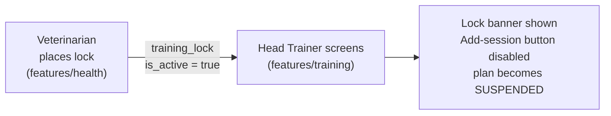

---

## 8. Target data model

Conceptual model taken from the team's SRS (Part 1). Column-level detail comes with the database design; the backend team owns the final schema. **25 entities**, grouped by flow.

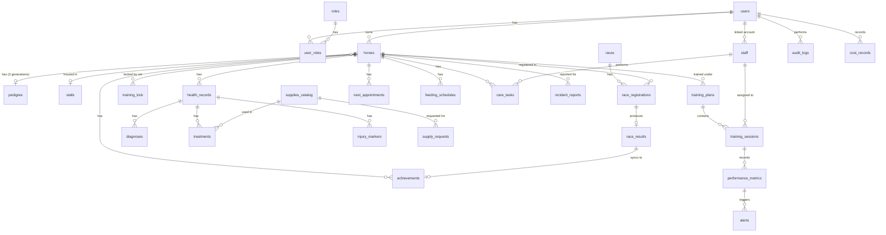

| Flow | Entities |
|---|---|
| 1 Auth and RBAC | `users`, `roles`, `user_roles` |
| 2 Horse profiles | `horses`, `pedigree`, `achievements`, `staff`, `supplies_catalog`, `stalls` |
| 3 Training | `training_plans`, `training_sessions`, `performance_metrics`, `training_lock`, `alerts` |
| 4 Health | `health_records`, `diagnoses`, `treatments`, `injury_markers`, `next_appointments` |
| 5 Dashboards | `audit_logs`, `cost_records` |
| 6 Stable | `feeding_schedules`, `care_tasks`, `incident_reports`, `supply_requests` |
| 7 Racing | `races`, `race_registrations`, `race_results` |

Status values that must match between web app and backend:

| Column | Values |
|---|---|
| `horses.health_status` | `FIT` · `UNDER_OBSERVATION` · `INJURED` · `QUARANTINED` |
| `training_plans.status` | `DRAFT` · `ACTIVE` · `PAUSED` · `COMPLETED` · `SUSPENDED` |
| `training_lock.scope` | `FULL` · `HIGH_INTENSITY_ONLY` |

A horse never has a "locked" status. It has a `health_status`, and whether it is locked is a separate `training_lock` record.

### Open point to align with the backend

The web app's account status has **8 values** (see [section 5](#5-account-lifecycle)), while the SRS lists only `PENDING`, `ACTIVE` and `LOCKED` for `users.account_status`. The extra values (`PENDING_EMAIL`, `PENDING_APPROVAL`, `PENDING_INTAKE`, `INVITED`, `INACTIVE`, `REJECTED`) come from the approved designs. Both sides must settle on one list before integration.
